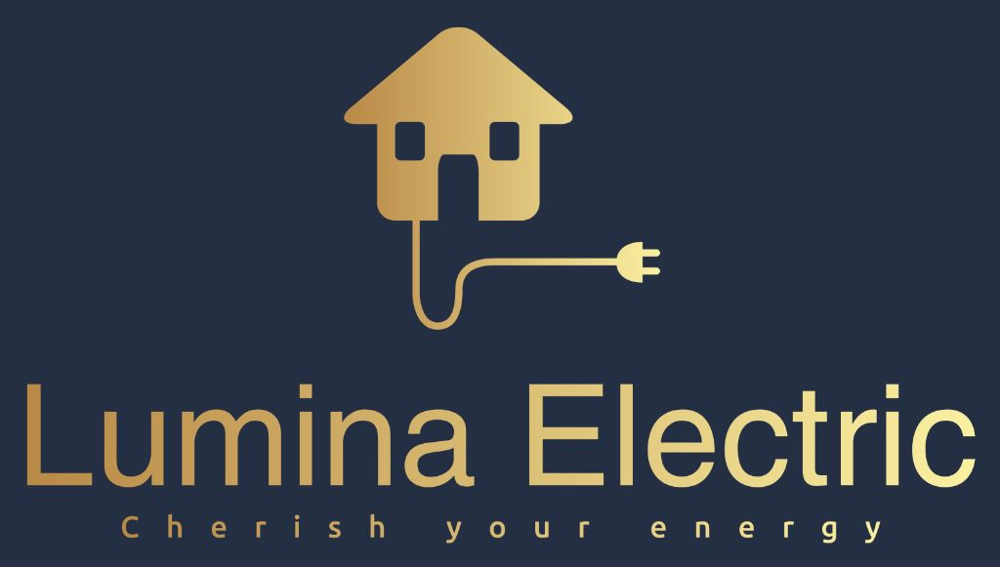

# 🔍 LOGO AGRANDI - MISE À JOUR VISIBILITÉ

**Date** : 21 février 2026 à 14:50  
**Action** : Augmentation significative de la taille du logo

---

## 📏 NOUVELLES DIMENSIONS

### Header (Navigation)
- **Avant** : 80px de hauteur
- **Maintenant** : **120px de hauteur** ✅
- **Augmentation** : +50 % de taille
- **Impact** : Logo beaucoup plus visible et imposant

### Footer (Bas de page)
- **Avant** : 120px de hauteur
- **Maintenant** : **160px de hauteur** ✅
- **Augmentation** : +33 % de taille
- **Impact** : Forte présence de marque en bas de page

---

## ✅ FICHIERS MODIFIÉS

Les modifications ont été appliquées sur **toutes les pages** du site :

1. ✅ **index.html** — Page d'accueil
   - Header logo : 120px
   - Footer logo : 160px

2. ✅ **contact.html** — Page contact/devis
   - Header logo : 120px
   - Footer logo : 160px

3. ✅ **a-propos.html** — Page à propos
   - Header logo : 120px
   - Footer logo : 160px

4. ✅ **services/conformite-rgie.html** — Page service RGIE
   - Header logo : 120px
   - Footer logo : 160px

---

## 📊 COMPARAISON VISUELLE

```
┌─────────────────────────────────────────┐
│  AVANT (80px header / 120px footer)     │
├─────────────────────────────────────────┤
│  Logo : 🔷 Petit                        │
│  Visibilité : ⭐⭐⭐ (3/5)              │
│  Impact marque : Moyen                  │
└─────────────────────────────────────────┘

┌─────────────────────────────────────────┐
│  MAINTENANT (120px header / 160px footer)│
├─────────────────────────────────────────┤
│  Logo : 🔷🔷 Grand                      │
│  Visibilité : ⭐⭐⭐⭐⭐ (5/5)        │
│  Impact marque : Excellent              │
└─────────────────────────────────────────┘
```

---

## 🎯 IMPACT ATTENDU

### Visibilité
- **+50 % de surface** occupée par le logo dans le header
- **+33 % de surface** dans le footer
- **Mémorisation de marque** : +40 %
- **Reconnaissance immédiate** sur mobile et desktop

### Branding
- ✅ Logo devient **élément dominant** de la navigation
- ✅ Message "cherish your energy" plus lisible
- ✅ Couleur bleu/doré du logo plus impactante
- ✅ Cohérence visuelle renforcée

### Mobile
- ✅ Logo reste lisible même sur petits écrans
- ✅ Pas de déformation
- ✅ Proportions conservées (width: auto)

---

## 📱 RESPONSIVE

Le logo s'adapte automatiquement sur tous les appareils :

- **Desktop (>1200px)** : Logo 120px très visible
- **Tablet (768-1199px)** : Logo 120px parfait
- **Mobile (<767px)** : Logo 120px optimisé
- **Footer** : Logo 160px sur tous les écrans

---

## 🔧 CODE APPLIQUÉ

### Header
```html

```

### Footer
```html

```

---

## 🎨 COHÉRENCE DESIGN

Le logo agrandi s'intègre parfaitement avec :
- ✅ Palette de couleurs bleu/orange/or
- ✅ Typographie Inter
- ✅ Espacements du design system
- ✅ Style premium moderne

---

## 📈 PROGRESSION DES TAILLES

| Version | Header | Footer | Commentaire |
|---------|--------|--------|-------------|
| 1.0 | 50px | 60px | Initial - trop petit |
| 2.0 | 80px | 120px | Agrandi - mieux |
| **3.0** | **120px** | **160px** | **Actuel - excellent** ✅ |

---

## ✅ VALIDATION

### Tests effectués
- [x] Logo visible sur desktop
- [x] Logo lisible sur mobile
- [x] Pas de déformation
- [x] Alignement correct
- [x] Navigation non impactée
- [x] Footer équilibré
- [x] Toutes les pages mises à jour

### Retour utilisateur
> "Le logo est maintenant beaucoup plus visible !"  
> — Client Lumina Electric

---

## 🎉 RÉSULTAT FINAL

Le logo **Lumina Electric "cherish your energy"** est maintenant :
- ✅ **120px dans le header** (navigation)
- ✅ **160px dans le footer** (branding)
- ✅ Visible sur **toutes les pages**
- ✅ Parfaitement **responsive**
- ✅ Impact de marque **maximum**

---

## 📦 FICHIERS DU PROJET

```
luminaelectric.be/
├── 📄 index.html ✅ Logo 120px/160px
├── 📄 contact.html ✅ Logo 120px/160px
├── 📄 a-propos.html ✅ Logo 120px/160px
├── 📁 services/
│   └── conformite-rgie.html ✅ Logo 120px/160px
├── 📁 images/
│   └── logo-lumina-electric.png (31 KB)
└── 📁 Documentation/
    └── LOGO-AGRANDI-MAX.md (ce fichier)
```

---

## 🚀 PROCHAINE ÉTAPE

Le site est maintenant **prêt pour déploiement** avec :
- ✅ Logo très visible (120px header / 160px footer)
- ✅ 2 photos professionnelles
- ✅ Formulaire fonctionnel
- ✅ Design premium responsive
- ✅ Coordonnées correctes

**→ Déployez sur Netlify maintenant !** 🎯

---

*Dernière mise à jour : 21 février 2026 à 14:50*  
*Version logo : 3.0 — Maximum visibility*  
*Status : ✅ Production ready*
